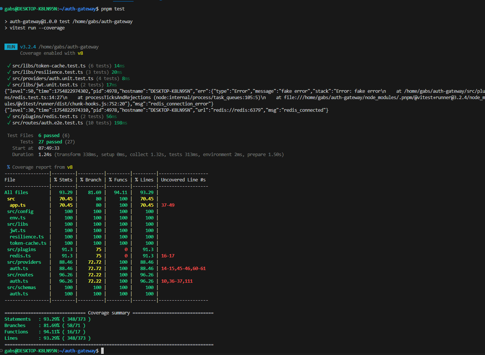
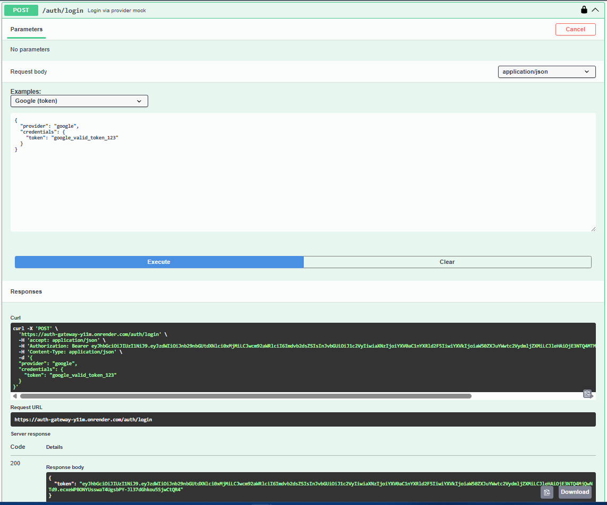
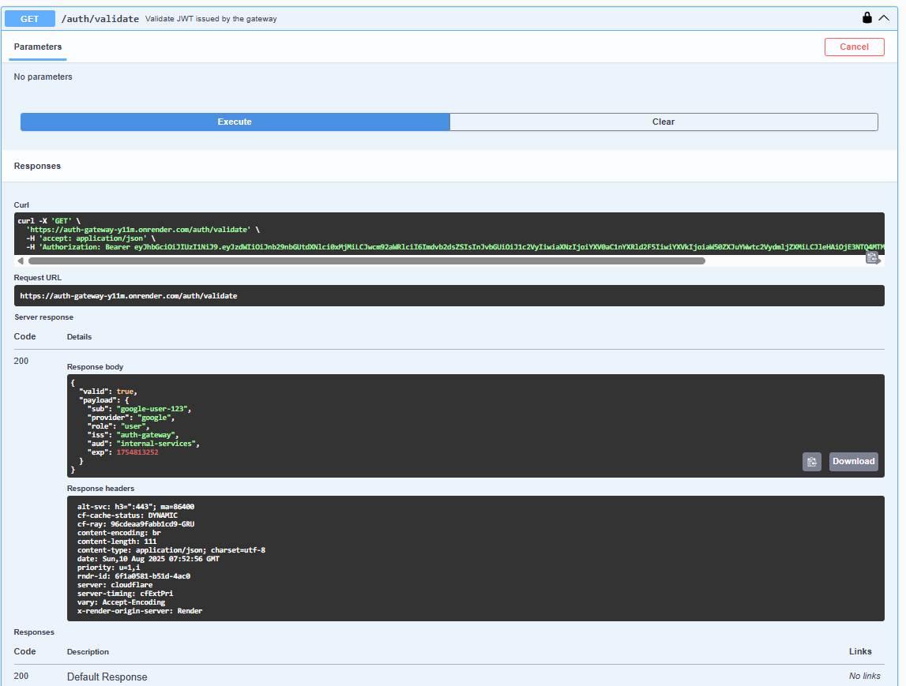
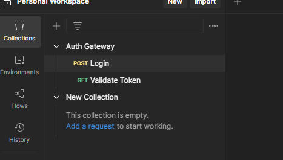
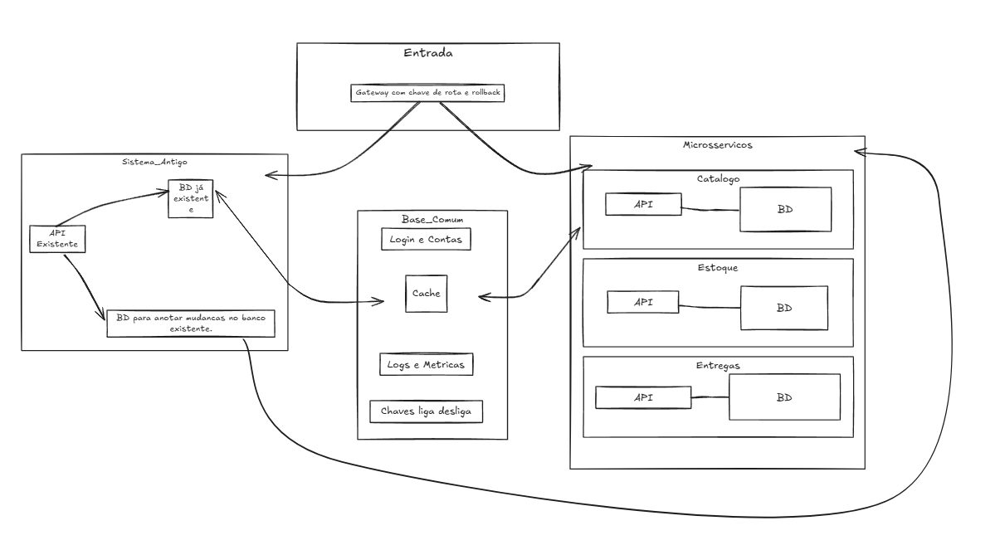

# Teste Backend NodeJs

## Parte 1 - Desenvolvimento Prático

**Demo:** [https://auth-gateway-y11m.onrender.com](https://auth-gateway-y11m.onrender.com)
**Swagger:** [https://auth-gateway-y11m.onrender.com/docs](https://auth-gateway-y11m.onrender.com/docs)

### O que foi feito

* Fastify + TypeScript
* JWT assinado pelo gateway (`iss`, `aud`, `exp`)
* Providers mock: `google` (token) e `azure` (user/pass)
* Rate limit por rota
* Cache de token usando Redis
* Swagger em `/docs`
* Health checks: `/health` e `/ready`
* Testes unitários e E2E (Vitest) com cobertura > 70%
* Dockerfile + docker-compose
* CI no GitHub Actions (typecheck, tests, build)

---

### Como rodar

### 1 Variáveis (.env)

```env
NODE_ENV=development
PORT=3000
LOG_LEVEL=debug
JWT_SECRET=contrataeuai
REDIS_URL=redis://localhost:6379 // -- usar redis://redis:6379 quando rodar pelo docker.
DISABLE_RATELIMIT=false
RATE_LIMIT_MAX=20
RATE_LIMIT_WINDOW=1 minute
ALLOW_MOCK_PROVIDERS=true
JWT_TTL_SECONDS=900
```

### 2 Local (sem Docker)

```bash
pnpm install
pnpm dev
# http://localhost:3000/docs
# redis: localhost:6379
```

### 3 Local com Docker

```bash
docker compose up --build
# app: http://localhost:3000
# redis: redis:6379
```

### 4 Testes

```bash
pnpm test           # run + coverage
```


---

### API

### POST /auth/login

```json
{
  "provider": "google",
  "credentials": { "token": "google_valid_token_123" }
}
# ou
{
  "provider": "azure",
  "credentials": { "username": "john.doe", "password": "Test@123" }
}
```



### GET /auth/validate

Header: `Authorization: Bearer <jwt>`


### Dados de teste

* Google válido: `google_valid_token_123`
* Azure: `john.doe/Test@123`



---

### Postman

Collection: `src/postman/auth-gateway.postman_collection.json`



---

### Docker (produção)

```bash
docker build -t auth-gateway:local .
docker run -p 3000:3000 \
  -e NODE_ENV=production \
  -e JWT_SECRET=super-secret \
  -e REDIS_URL=rediss://<upstash_url> \
  auth-gateway:local
```

---

### Deploy demo (Render + Upstash)

* **Upstash Redis (Free)** → pegue `REDIS_URL` (`rediss://...`).
* **Render (Docker)**

  * Env: `NODE_ENV=production`, `PORT=10000`, `JWT_SECRET`, `REDIS_URL`, etc.
  * Health Check: `/health`
  * Start: usa `CMD` do Dockerfile (`node dist/server.js`).
  * Auto‑Deploy na `main`;

---

### CI/CD

* **CI**: `.github/workflows/ci.yml` → typecheck, testes, build. Na `main` também builda/pusha imagem para GHCR.
* **CD**: com **Auto‑Deploy** do Render ou disparado manualmente pela plataforma.

---


### trade‑offs 

> Eu tentei seguir bem o tempo, considerando que normalmente recebemos tarefas com "prazos/pontos" então não me prolonguei além das (\~6h), foquei em realizar as 3 tarefas e ter uma **API funcional**, com testes, Docker e deploy simples.

Ficou pendente para fazer:

    - Circuit breaker
    - Observabilidade
    - Testes de carga
    - Feature flags
    - formalizar ADRs 
    - Kubernetes (nunca tive a oportunidade de usar)
    - Revogação/blacklist de tokens
    - Deploy/CD automatizado (apenas Auto‑Deploy do Render pela `main`).

> Perdi um tempo com erros de docker, e por usar solução free tier pra deploy. (eu normalmente uso Hostinger/AWS) que é tudo manual e diferente, testei umas 4 plataformas diferentes até chegar no Render :( kk


## Parte 2 Design de Solução  

**Desafio:** migrar 10M usuários do monólito para microsserviços **sem downtime**.

### diagrama da solução


-> O Gateway verifica para onde mandar a requisição.
    -> se for p/ monolito entao api antiga atende e salva os dados no banco antigo;
    -> as mudancas sao salvas no banco que anota as mudancas
    -> os microservicos lêem as mudancas e replicam no respectivo banco.

-> Se for p/ microservico
    -> O microsserviço usa seu bd e acessa a Base Comum (login, cache, logs).

### Migração faseada

1. Preparar tudo: 
    - BD p/ registrar as mudanças do monolito
    - Observabilidade de logs, métricas p/ garantir zero downtime
    - Configurar chaves liga/desliga no Gateway
    - Fazer com que os microsserviços possam ler as mudanças e atualizar seus bd.

2. Fase 1 
    - O Gateway manda tudo pro sistema antigo.
    - Cria uma replica das requisições p testar os microservicos.
    - Compara respostas e corrige problemas.

3. Fase 2
    - Migrar porções pequenas pro microservico.
    - Checar se bancos batem (comparar amostras).

4. Fase 4
    - Valida que tudo funciona
    - Aumentar tráfego pros microservicos até chegar em 100%.

5. Fase 5
    - Remove o codigo do monolito
    - Remove a replicacao p banco de replica

### Rollback
    Sempre monitorar os logs e metricas;
    Usar chave liga/desliga no Gateway para voltar tráfego pro antigo imediatamente;
    Se der problema no microservico, o monolito continua atualizado porque estava recebendo todas as gravações.
    corrige o erro e volta aos poucos pro microservico.

### Consistencia
    Cada microservico tem seu próprio banco/estrutura
    Temos o banco replicando os dados, que mantém os bancos novos atualizados enquanto ainda não recebem tráfego.
    Quando for gravar no novo, usar id único por requisição para não duplicar dados.
    Realizar amostragem de tempo em tempo.

### Performance
    Uso de cache
    Escalar um microservico se sobrecarregar
    Monitorar latencia e deixar bd otimizado    

### Performance
    Login separado dos microservicos em um unico lugar tanto p monolito como p microservico;
    usar https com certificados
    usar variaveis de ambiente
    validar permissoes por cada endpoint x microservico.

### Monitoramento
    Monitorar tempo de resposta
    Taxa de Erro
    Latencia
    Tráfego
    Uso de CPU
    Uso de Memoria
    Usar grafana ou um dashboard em tempo real.

---

## Parte 3 — Análise de código

### Segurança

Possível SQL injection: se usar SELECT \* FROM users WHERE email = '[gabriel.r.s@outlook.com](mailto:gabriel.r.s@outlook.com)' OR '1'='1'
Refatorar com:

```ts
const [rows] = await db.query("SELECT * FROM users WHERE email = ?", [email]);
```

Senha exposta: compara senha texto a texto.
Refatorar com:

```ts
const ok = await bcrypt.compare(password, user.password_hash);
```

Segredo exposto sem uso de .env: 'secret-key' no código.
Refatorar com:

```ts
const JWT_SECRET = process.env.AUTH_JWT_SECRET!;
```

JWT fraco: sem expiração.
Refatorar com:

```ts
const token = jwt.sign({ sub: String(user.id) }, JWT_SECRET, { expiresIn: "15m", issuer: "auth-gateway", audience: "app" });
```


### Performance

SELECT \* e sem índice: busca colunas demais e sem índice.
Refatorar com:

```sql
CREATE UNIQUE INDEX idx_users_email ON users(email);
```

```ts
"SELECT id, email, password_hash FROM users WHERE email = ? LIMIT 1";
```

Chamada ao legado sem timeout: pode travar esperando.
Refatorar com:

```ts
const ctrl = new AbortController();
const t = setTimeout(() => ctrl.abort(), 3000);
const res = await fetch(`${LEGACY}/users/${userId}`, { signal: ctrl.signal });
clearTimeout(t);
```

---

### Manutenibilidade

Dependências fixas: difícil testar.
Refatorar: injetar `db`, `jwt`, `fetch`.

Erros genéricos: difícil saber o motivo.
Refatorar: mensagens claras para cada caso.

Sem validação: email e senha sem checar.
Refatorar: validar antes de usar.

---

### Débitos técnicos

Logs despadronizados: difícil rastrear.
Segredos no código: risco de vazamento.
Sem testes: risco de quebrar algo.

---